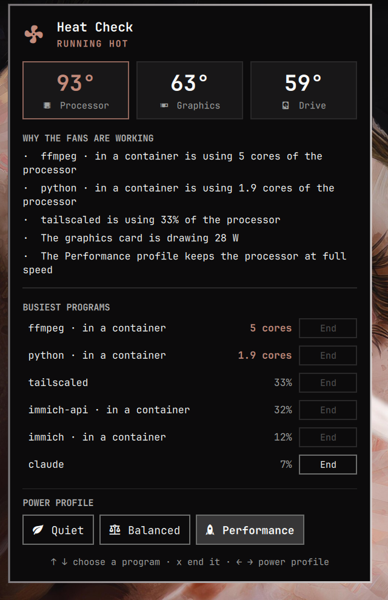

# Heat Check for Omarchy

Bar widget that answers one question: why are my fans so loud?



- **Live readings in the bar**: the temperatures of the processor, the graphics card and the drive, updated every few seconds
- **Why the fans are working**, in plain sentences: which program keeps how many processor cores busy, what the graphics card draws, and whether the Performance profile is on
- **Busiest programs**, measured over the last second rather than averaged since they started. Helper processes are named for what they do: a browser tab, the browser's graphics process, something inside a container
- **End**: ask one of your own programs to quit, with a second press to confirm
- **Power profile**: switch between Quiet, Balanced and Performance

The readings turn to the alert colour while the processor is hot. Click them to open the panel.

To put the widget in the middle of the bar, next to the weather:

```bash
omarchy bar move io.github.badr-emil.heat-check --after omarchy.weather
```

The centre of the bar is narrow on a laptop screen. If the readings run into the widgets on the right, move a few of those away or switch `showReadings` off to get a single fan icon instead.

Keyboard: `↑` `↓` (or `j` `k`) choose a program, `x` ends it (press twice), `←` `→` (or `h` `l`) change the power profile.

## Install

```bash
omarchy plugin add https://github.com/Badr-Emil/omarchy-heat-check --enable
```

Uses `jq` and `powerprofilesctl`, both shipped with Omarchy. With an NVIDIA card, `nvidia-smi` adds its temperature, load and power draw; the card is only asked while it is already running, so the panel never wakes a sleeping graphics card. Without `powerprofilesctl` the profile switch is hidden.

Fan speed is not shown: most laptops do not expose it to Linux.

## What it can and cannot end

**End** sends the ordinary request to quit (SIGTERM) to a single process of your own user. It never forces a kill and never touches processes of other users, so system services and anything inside a Docker container show a greyed-out button. Ending a browser tab's process closes that tab's page ("Aw, Snap"), not the browser.

## Settings

- `showReadings` (default true): show the temperatures in the bar; off shows a fan icon. A vertical bar always gets the icon
- `showLoad` (default false): also show the processor load in the bar
- `hotAt` (default 85): processor temperature in °C from which the machine counts as hot
- `refreshIntervalSec` (default 5): how often the bar readings are updated
- `hideWhenCool` (default false): only show the widget while the processor is hot

## Privileges

Everything runs as your user. `scripts/heat-status` reads `/proc` and `/sys` and calls `powerprofilesctl get` and, for an awake NVIDIA card, `nvidia-smi`. The panel calls `powerprofilesctl set` and `scripts/heat-end`. The bar runs once per display, so the latest readings are shared through a small file in your private runtime directory (`$XDG_RUNTIME_DIR/omarchy-heat-check/`, in memory, gone after logout). Nothing runs as root, nothing is downloaded, and no service is installed.

## Development

```bash
node --test tests/
```

## Remove

```bash
omarchy plugin remove io.github.badr-emil.heat-check
```
